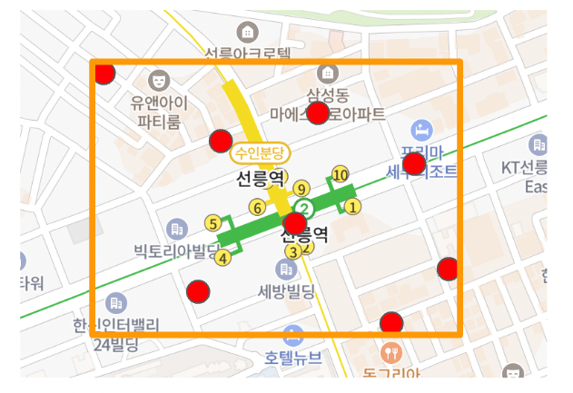

import { ClusterSample } from "@site/src/components/ClusterSample"

# 유용한 기능

## 폴리곤 관련 계산

PolygonCalculator 에서는 폴리곤 관련 계산 기능을 제공합니다.

### getRegionInfo

좌표의 배열을 받아서 좌표를 모두 포함하는 사각형의 정보를 리턴합니다.
(maxLat, minLat, maxLng, minLng, centerLat, centerLng)



위의 그림을 보면 사각형이 어떤 영역에 위치하는지 알 수 있습니다.

이 정보를 이용하면 여러 좌표의 분포에 따라 뷰포트에서 센터를 자동으로 적절히 이동해주거나 panning 처리할때 유용하게 쓸 수 있습니다.

### getRegionStart

getRegionInfo 로 얻은 사각형의 minimum Position 값입니다.

### getRegionEnd

getRegionInfo 로 얻은 사각형의 maximum Position 값입니다.

### getCenter

getRegionInfo 로 얻은 사각형의 center Position 값입니다.

### intersects

좌표로 구성된 서로 다른 두 폴리곤 path (Position[]) 간에 교차점이 하나라도 있는지 체크하는 기능입니다.

폴리곤이나 라인 등이 서로 겹치는지 판단할 때 유용합니다.

### getIncludedPositions

주어진 폴리곤 안에 특정 좌표들이 포함되는지 체크하는 기능입니다.

범위를 지정하여 그 안에 들어오는 좌표들을 찾아낼 때 유용합니다.

### simplifyPoints

주어진 폴리곤 좌표를 단순화 처리합니다.

보통 시도의 경계와 같은 데이터의 원본은 표현할 맵의 축척에 비해 너무 큰 경우가 많습니다. 
이를 단순화하면 보기에도 깔끔해지고 성능적으로도 좀 더 나은 결과를 얻을 수 있습니다.

tolerance 파라미터는 단순화 처리할 기준 거리값 입니다. 기본값은 1 입니다.

### calculatePolygonSize

주어진 폴리곤의 면적을 구합니다. 단위는 m2 입니다.

## 클러스터 계산

### getClusterInfo

주어진 조건에서 좌표 목록에 대해 클러스터 정보를 계산합니다. 클라이언트에서 간단히 클러스터 형태를 렌더링할때 사용할 수 있습니다.

> 현재 화면의 뷰포트를 기준으로 격자로 나누어 계산하는 방식이므로 클러스터 모양이 동일 좌표군에 대해 항상 동일하지는 않습니다. 

```javascript
import { Bounds, CircleMarker, ClusterInfo, MintMapController, Position, getClusterInfo } from '@mint-ui/map';
import React, { useMemo, useRef, useState } from 'react';

import { MintMap } from './common/BaseMap';

const CENTER = new Position(37.4004906706981, 127.107806987924);

export function ClusterSample() {
  const mintController = useRef<MintMapController>();
  const [ currBounds, setCurrBounds ] = useState<Bounds|null>(null);
  const [ markers ] = useState<Position[]>(getRandomData(CENTER, 100)); // 랜덤하게 Position[] 생성
  const memo = useMemo(() => {
    if (!currBounds || !mintController.current) {
      return null;
    }

    // 지도의 컨테이너 element
    const elem = mintController.current.mapDivElement;

    // 기본 크기 ( = 격자의 픽셀 크기)
    const baseSize = 50;

    // 클러스터 정보 구하기
    const clusterList = getClusterInfo(baseSize, currBounds, elem.offsetWidth, elem.offsetHeight, markers) as ClusterInfo[];

    // 사이즈 결정
    const maxItemSize = Math.max(...clusterList.map((c) => c.itemList.length));
    const getSize = (size:number) => baseSize * (size / maxItemSize);

    return (
      <>
        {clusterList.map((item, idx) => {
          // 클러스터 크기 정하기
          const baseSize = getSize(item.itemList.length);

          return (
            <CircleMarker
              key={`circle-${idx}`}
              center={item.centerPosition}
              radius={baseSize}
              background='orange'
              shapeProperties={{ stroke: 'red', fillOpacity: 0.5 }}
            ><div style={{ display: 'flex', justifyContent: 'center', alignItems: 'center', height: '100%', fontSize: '20px' }}>{item.itemList.length}</div>
            </CircleMarker>
          );
        })}
      </>
    );
  }, [ markers, currBounds ]);

  return (
    <MintMap
      base={{ center: CENTER, zoomLevel: 12 }}
      onLoad={(_v, c) => {
        mintController.current = c;
        setTimeout(() => setCurrBounds(c.getCurrBounds()), 1000);
      }}
    >{memo}
    </MintMap>
  );
}

```

<ClusterSample />