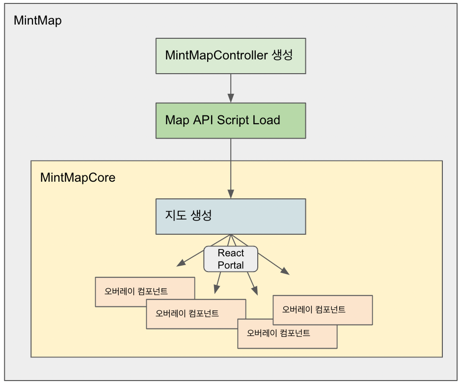

# 기본 컴포넌트 구조

가장 상위의 컴포넌트인 MintMap 컴포넌트는 내부적으로 지도에 맞는 전용 MintMapController 를 생성하고 지도 API 스크립트를 로드합니다.

이 동작이 완료되면 MintMapCore 컴포넌트내에서 컨테이너 div 에 지도를 렌더링하여 최초 지도가 화면에 표시됩니다.

MintMap 하위에 children 으로 들어가는 컴포넌트들은 React Portal 을 통해 지도 오버레이 객체들과 React 컴포넌트가 연결됩니다.