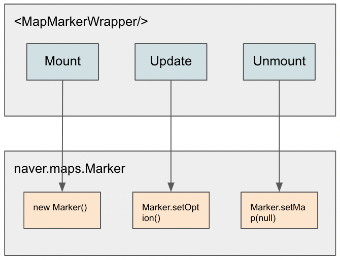

# 라이프 사이클의 이해

지도에 마커와 같은 오버레이 객체를 생성하는 대표적인 컴포넌트인 MapMarkerWrapper 는 아래와 같은 라이프사이클을 갖습니다.

보통 마커와 같은 객체는 비용이 많이 드는 객체이기 때문에 필요 이상의 객체가 생성/삭제 되는 것에 항상 유의 해야합니다.

특히 리스트로 렌더링 하는 경우 React 의 key 에 기반하여 라이프사이클이 동일하게 적용되므로, **컴포넌트는 반드시 유니크 키를 갖아야 합니다.**
만약 이 부분이 적절하게 처리되어 있지 않으면 많은 수의 객체가 생성/삭제를 반복하면서 성능에 치명적인 문제가 생길 수 있습니다.

> MintMap 컴포넌트의 debug prop 에 true 를 주면 마커가 생성/삭제될때 console 에 로그가 남아서 추적이 가능합니다.