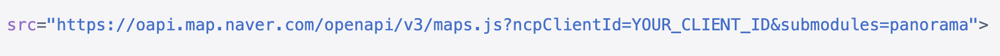

# 기본 기능
## 지도 불러오기

MintMap 컴포넌트를 사용하여 지도를 불러오기 위해서는 두개의 값이 필수입니다.

### mapType

지도의 타입을 결정합니다.  이 값이 바뀌면 해당 지도에 대한 스크립트 로드 및 지도 렌더링이 일어나며, 이전에 생성되어 있던 지도는 해제처리됩니다.

### mapKey

지도의 타입에 따라 인증키를 입력합니다.

이 값은 지도 API 스크립트를 불러올때 사용되는데, 이미 스크립트를 불러온 적이 있는 경우 다시 로드되지는 않습니다.  즉, 이미 로드된 경우에는 키를 변경해도 변경된 키로 적용이 되지 않습니다.

## 스크립트 로드

지도 API 스크립트를 불러올때 추가 파라미터를 설정할 수 있습니다.

### scriptModules

지도마다 지원하는 서브 모듈을 지정하여 불러올 수 있습니다.

아래의 경우 scriptModules={['panorama']} 가 적용된 모습입니다.



### scriptParams

스크립트 로드시에 서브 모듈을 제외한 추가 파라미터를 지정할 때 사용합니다.  내부적으로 key=value 의 형태로 처리됩니다.

```javascript
scriptParams={{aaa:111, bbb:222}}
=> aaa=111&bbb=222
```

## 반응형 속성

일부 속성들은 반응형으로 데이터의 변경이 지도의 렌더링에 반영됩니다.

### visible

지도의 visible 설정으로 지도를 숨길 수 있습니다.

내부적으로 숨겨지기만 하는 것으로, 렌더링된 내용은 그대로 유지됩니다.

```javascript
<MintMap visible={false}>
```

### center

이 값에 지정된 좌표를 중심으로 하도록 설정합니다.  이 좌표를 변경하면 지도 중심이 이동됩니다.

```javascript
const [centerPosition, setCenterPosition] = useState(new Position(37.504497373023206, 127.04896282498558));

useEffect(()=>{
  // 3초뒤에 새로운 좌표로 중심 이동
  setTimeout(()=>setCenterPosition(new Position(37.50449731, 127.04896283)), 3000)
}, [])

return <MintMap center={centerPosition}>
```

### centerMoveWithPanning

이 값이 true 이면 center 의 변경이 일어났을때 panning 효과와 함께 이동합니다.  
> panning 을 지원하지 않는 지도의 경우는 효과 없이 이동만 합니다. (현재 naver 만 지원됨)

```javascript
<MintMap centerMoveWithPanning={true}>
```

### zoomLevel

지도의 줌 레벨을 설정합니다.  이 값을 변경하면 지도의 줌레벨이 변경됩니다.

```javascript
const [zoomLevel, setZoomLevel] = useState(15);

useEffect(()=>{
  // 3초뒤에 줌레벨 20으로 변경
  setTimeout(()=>setZoomLevel(20), 3000)
}, [])

return <MintMap zoomLevel={zoomLevel}>
```

### draggable

이 값이 true 이면 마우스의 드래그로 지도 위치를 움직일 수 있습니다.

### keyboardShortcuts

이 값이 true 이면 키보드의 방향키로 지도의 위치를 움직일 수 있습니다.

### dissolveEffectWhenLoaded

지도가 로딩 된 후 장면전환 효과를 사용할지 여부입니다. false 로 하면 해당 효과가 사라집니다.

## 줌 레벨 참고

MintMap 에서는 줌 레벨을 1 ~ 22 까지 선택 가능합니다.
하지만 지도마다 지원하는 레벨에 차이가 있습니다.  

- google 지도는 1 ~ 22 까지 모든 레벨을 지원합니다.
- naver 지도는 6 ~ 21 까지 지원합니다.
- kakao 지도는 6 ~ 19 까지 지원합니다.

줌 레벨은 지도마다 고유의 값을 가집니다. 
예를들어 500m 정도의 축척은 google 에서는 13 이지만 kakao 에서는 7 입니다. 
이것을 MintMap 내부에서 통일하여 자동 매핑해주기때문에 사용자는 1 ~ 22 의 동일한 값을 사용하면 됩니다.

아래는 지도별 줌레벨과 축척을 표로 정리한 것입니다.

### 줌레벨과 축척 정리표

| MintMap | google | naver | kakao | 축척 (참고치) |
| --- | --- | --- | --- | --- |
| 1 | 1 | x | x | 6000 km |
| 2 | 2 | x | x | 2000 km |
| 3 | 3 | x | x | 1000 km |
| 4 | 4 | x | x | 500 km |
| 5 | 5 | x | x | 200 km |
| 6 | 6 | 6 | 14 | 100 km |
| 7 | 7 | 7 | 13 | 50 km |
| 8 | 8 | 8 | 12 | 20 km |
| 9 | 9 | 9 | 11 | 10 km |
| 10 | 10 | 10 | 10 | 5 km |
| 11 | 11 | 11 | 9 | 2 km |
| 12 | 12 | 12 | 8 | 1 km |
| 13 | 13 | 13 | 7 | 500 m |
| 14 | 14 | 14 | 6 | 300 m |
| 15 | 15 | 15 | 5 | 100 m |
| 16 | 16 | 16 | 4 | 50 m |
| 17 | 17 | 17 | 3 | 25 m |
| 18 | 18 | 18 | 2 | 20 m |
| 19 | 19 | 19 | 1 | 10 m |
| 20 | 20 | 20 | x | 5 m |
| 21 | 21 | 21 | x | 3 m |
| 22 | 22 | x | x | 1 m |