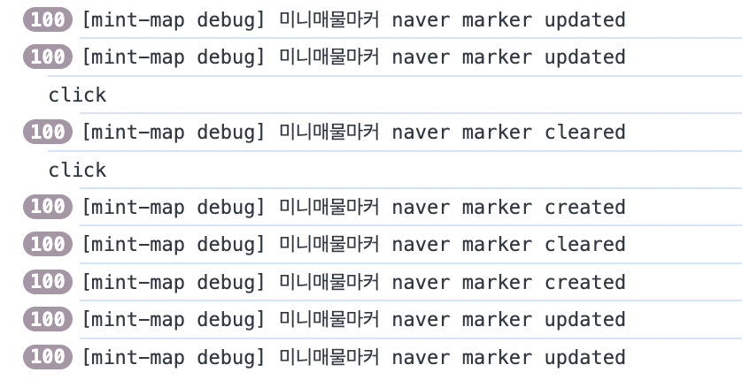
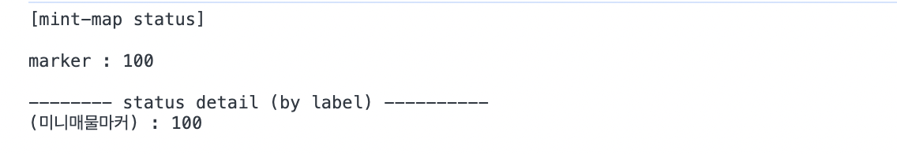

# 디버그 모드

마커의 생성/해제 등을 추적할 수 있게 하는 모드입니다.
이 옵션을 활성화시켜면 console.log 에 해당 정보가 찍힙니다.



## 디버그 활성화

몇가지 옵션을 통해 활성화가 가능합니다.

### debug

MintMap 에 지정하는 경우, 하위의 모든 마커의 디버그가 활성화됩니다.

```javascript
<MintMap debug={true}>
```

MapMarkerWrapper 에 직접 지정도 가능합니다. 이 경우에는 해당 마커만 디버그가 활성화됩니다.

```javascript
<MintMap>

  <MapMarkerWrapper debug={true}>
    <SalesSimpleMarker />
  </MapMarkerWrapper>

</MintMap>
```

### debugLabel

해당 마커의 debug 에 같이 표기되는 label 을 지정합니다.  이것을 이용하면 특정 마커만 구별해서 보기 좋습니다.

```javascript
<MintMap debug={true}>

  <MapMarkerWrapper debugLabel="미니매물마커">
    <SalesSimpleMarker />
  </MapMarkerWrapper>

</MintMap>
```

### MintMapController.printStatus

현재 생성되어 있는 마커의 디버그 정보를 console 에 출력합니다.

```javascript
MintMapController.printStatus();
```

