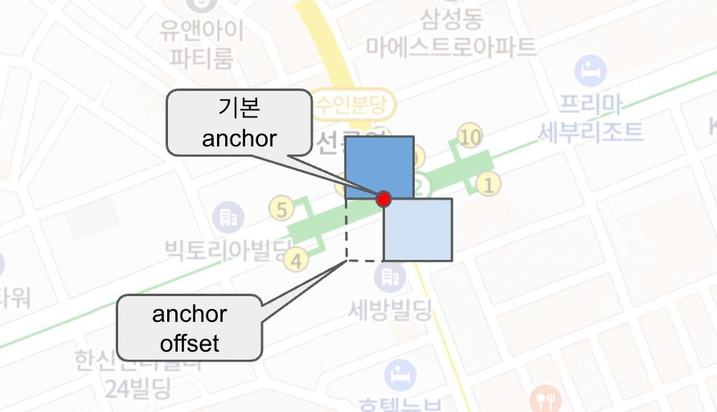
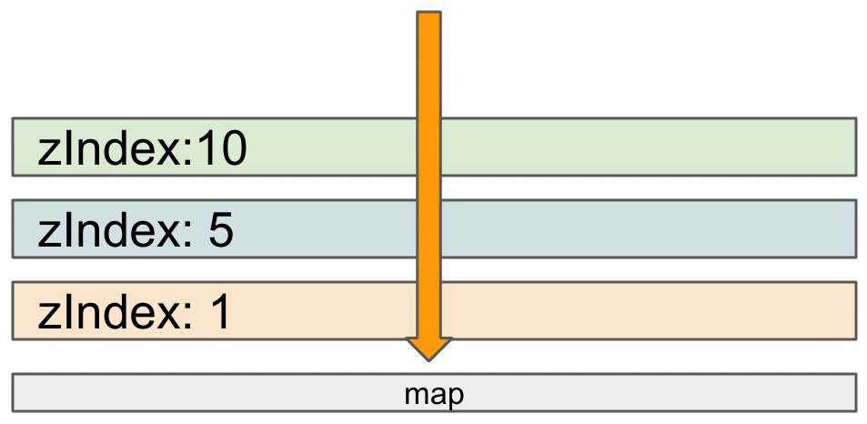
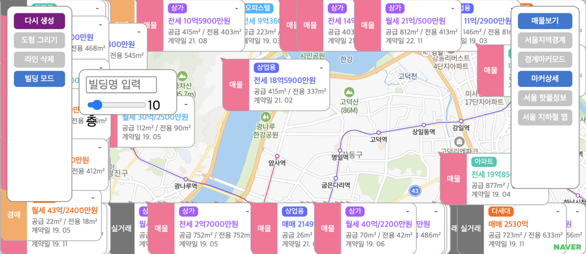
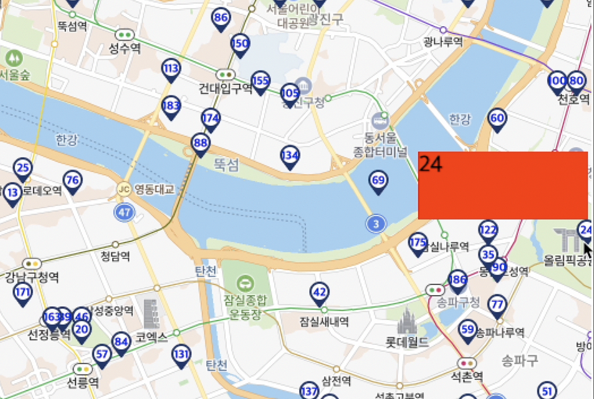

import { MapRacing } from "@site/src/components/MapRacing/MapRacing"

# 기본 마커

MapMarkerWrapper 컴포넌트는 지도 위에 정보를 보여주는 가장 기본적인 방법입니다. 
children 으로 React Node 를 넣으면 지정된 위치에 Element 가 렌더링 됩니다.

## 기본 기능

마커에 원하는 위치의 좌표를 넣고 children 에 마커의 Element 를 넣으면 지도에 표시됩니다.

```javascript
<MintMap>

  <MapMarkerWrapper position={new Position(37.504497373, 127.04896282)}>
    <div style={{width:'20px', height:'20px', background:'red'}} />
  </MapMarkerWrapper>

</MintMap>
```

지도위에 그려지는 컴포넌트는 다음의 공통 속성을 갖습니다.

### position

마커가 찍힐 좌표를 지정합니다.

### anchor

마커의 좌표 기준으로 offset 을 설정합니다.

MintMap 에서 마커의 anchor 는 왼쪽상단으로 맞춰져 있습니다. (모든 지도 동일)
이 위치를 기준으로 offset 을 설정한 만큼 마커가 옮겨져서 그려집니다.



### zIndex

마커의 표시 순서를 지정합니다. 

기본적으로는 그려지는 순서대로 표시되는데, 이것을 직접 수치로 지정할 수 있습니다.

이것을 이용하면 그려지는 마커의 그룹에 따라 zIndex 를 정해놓고 각 레이어들이 on/off 상태에 따라 의도대로 표현되도록 조정할때 유용합니다.



### visible

이 값을 false 로 설정하면 해당 마커가 숨겨집니다.

### event

마커에 이벤트를 Map 형식으로 설정합니다.

```javascript
<MintMap>

  <MapMarkerWrapper position={new Position(37.504497373, 127.04896282)}
  event={new Map([
    [ 'mousedown', ()=>{} ],
    [ 'mouseup', ()=>{} ]
  ])}
  >
    <div style={{width:'20px', height:'20px', background:'red'}} />
  </MapMarkerWrapper>

</MintMap>
```

이것을 통해 이벤트를 설정하면 내부적으로 지도 유형에 따라 event 가 추가됩니다.
마커가 지도에서 삭제되면 이벤트가 해제되도록 처리되어 있습니다.

이 방식은 지도 API 상의 마커 이벤트를 직접 이용합니다.
하지만 이벤트가 마커 엘레멘트의 가장 상위에 밖에 지정이 안되기 때문에
특수한 상황을 제외하고는 **children 의 원하는 부분에 직접 react 이벤트를 설정하는것이 좋습니다.**

### debug

이 값을 true 로 설정하면 마커가 create/update/remove 될때 마다 console 에 로그가 찍힙니다.
마커의 라이프사이클을 추적할때 사용하면 좋습니다.

### debugLabel

debug 값이 true 일때 찍히는 로그의 label 을 설정합니다. 로그상에서 특정 마커를 식별하기 위해 사용할 수 있습니다.

## 마커 기능

### topOnClick

이 값이 true 이면 클릭했을때 마커의 zIndex 가 가장 위로 올라가게 처리됩니다.

### topOnHover

이 값이 true 이면 마커에 마우스가 오버됐을때 마커의 zIndex 가 가장 위로 올라가게 처리됩니다.

### movingAnimation

마커가 특정 path 를 따라 움직이게 해줍니다.
이 옵션으로 전철 노선도 와 같은 path를 따라 이동하는 마커를 간단하게 구현이 가능합니다.

movingAnimation 의 세부 속성은 다음과 같습니다.

- autoStart : true 이면 마커 컴포넌트가 생성되면 바로 이동이 시작됩니다.
- positions : 마커가 따라갈 path 의 정보입니다.  Position 의 배열로 구성됩니다.
- positionClosed : 지정된 path 가 닫힌 path 인지 여부입니다. 이 값이 true 이면 path 의 마지막 position 에서 애니메이션이 끝납니다.
- startPositionIndex : path 상의 특정 position 에서 이동을 시작하게 합니다.
- velocity : 마커의 이동 속도를 설정합니다. 단위는 km/h 입니다. (60이면 시간당 60km 이동)
- loop : path의 마지막 위치에서 계속 재생할지 여부입니다.
- fps : 초당 몇번 움직일지의 여부입니다. 이 값이 2이면 초당 2번 이동합니다. fps 가 높으면 그만큼 이동을 위한 계산을 많이 하게되므로 성능을 잘 체크해야합니다.

아래는 movingAnimation 을 이용한 간단한 레이싱 게임입니다.

<MapRacing />

### disablePointerEvent

마커의 포인터 이벤트를 이 속성을 이용하여 끌 수 있습니다.  다시 이벤트를 받고 싶은 하위 엘레먼트에서는 css 에서 이 속성을 auto 또는 유효한 값으로 반드시 변경해줘야 합니다.

### autoFitToViewport

이 값이 true 이면 viewport 내에 마커가 잘리지 않고 보이도록 마커 위치를 자동으로 옮겨줍니다.



### autoAdjustAnchor

이 값이 true 이면 마커가 viewport 를 넘어가는 경우 anchor 를 기준으로 반전 처리하여 최대한 잘리지 않고 잘 보이도록 보정해줍니다.



위의 그림에서 24번 마커는 viewport 오른쪽으로 넘어가게 되므로 자동 반전되어서 왼쪽으로 그려지는걸 볼 수 있습니다.

### autoAdjustAnchorConfig

autoAdjustAnchor 옵션을 이용하여 자동반전 처리될때 기준 마커를 가리는 경우가 발생 할 수 있는데, 이를 막기위해 autoAdjustAnchorConfig 에 추가 보정치를 줄 수 있습니다.

> ex) autoAdjustAnchorConfig = {marginLeft:30} ⇒ 왼쪽으로 반전될때 30px 만큼 더 보정한다.