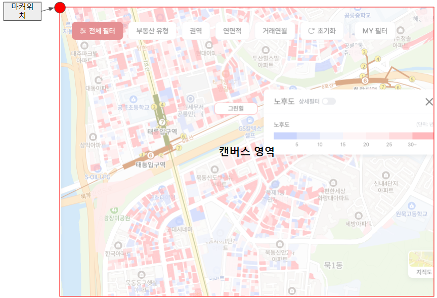

import { CanvasMarkerMap } from "@site/src/components/CanvasMarkerMap"

# 캔버스 마커

## 기본 개념

CanvasMarker 컴포넌트는 마커를 HTML Canvas 에 그릴 수 있게 해줍니다.

다른 마커 컴포넌트와는 다르게 컴포넌트 자체에는 위치를 지정할 필요가 없습니다.
마커는 자동으로 왼쪽 상단에 고정되며 이것을 기준으로 뷰포트 크기만큼 캔버스가 덮는 형태를 가집니다.



만약 지도를 이동하게 되면 마커의 위치도 같이 움직입니다. 즉, 항상 뷰포트 기준 왼쪽 상단에 위치하게 됩니다.


```javascript
import { CanvasMarker, Position } from '@mint-ui/map';
import React, { useState } from 'react';

import { MintMap } from './common/BaseMap';

const CENTER = new Position(37.4004906706981, 127.107806987924);

export function CanvasMarkerMap() {
  const [ markers ] = useState(getRandomData(CENTER, 3000)); // 랜덤하게 Position[] 생성

  return (
    <MintMap
      base={{ center: CENTER, zoomLevel: 14 }}
    >
      <CanvasMarker
        renderer={({ context, offset, payload }) => {
          context.beginPath();

          // 사각형
          context.rect(offset[0].x, offset[0].y, 20, 20);
          context.fillStyle = 'orange';
          context.fill();

          // 사각형 외곽선
          context.strokeStyle = 'red';
          context.strokeRect(offset[0].x, offset[0].y, 20, 20);

          // 폰트
          context.fillStyle = 'white';
          context.font = '10px caption';
          context.fillText(String(payload?.no), offset[0].x + 2, offset[0].y + 14);
          context.closePath();
        }}
        zIndex={2}
        data={markers}
      />
    </MintMap>
  );
}
```

아래는 마커를 3000개 그린 결과입니다.
다른 마커와 다르게 성능저하가 없습니다.

<CanvasMarkerMap />

>현재까지는 그려진 마커에 대한 이벤트처리가 불가능합니다.
이 부분은 직접 이벤트 구현을 해야합니다.
아니면 이벤트가 필요없는 단순 오버레이 객체를 다수 그려야 할때 사용하는게 좋습니다.

## 기본 기능

### renderer

캔버스 마커가 렌더링될때 호출되는 함수입니다.

함수의 파라미터 context 는 CanvasRenderingContext2D 객체로, 이것을 사용하여 캔버스에 드로잉이 가능합니다.

```javascript
renderer={({ context, offset, payload }) => {
  context.beginPath();

  // 사각형
  context.rect(offset[0].x, offset[0].y, 20, 20);
  context.fillStyle = 'orange';
  context.fill();

  // 사각형 외곽선
  context.strokeStyle = 'red';
  context.strokeRect(offset[0].x, offset[0].y, 20, 20);

  // 폰트
  context.fillStyle = 'white';
  context.font = '10px caption';
  context.fillText(String(payload?.no), offset[0].x + 2, offset[0].y + 14);
  context.closePath();
}}
```

offset 은 현재 뷰포트 기준의 픽셀 좌표값의 배열입니다.
data 파라미터에 position:Position[] 값을 같이 넘겨주면 내부적으로 현재 뷰포트 기준의 값으로 변환되어 offset 으로 리턴됩니다.
이 값을 사용하여 캔버스에 그릴 수 있습니다.

> data 에 position 값이 없으면 offset 배열은 비어있습니다. 이때, 직접 뷰포트 기준으로 픽셀 좌표를 renderer 내부에서 구할수도 있습니다.
MintMapController.positionToOffset(position:Position) 을 이용합니다.

payload 는 data 에 넘겨준 배열의 항목을 리턴받습니다. 
마커를 그릴때 필요한정보를 payload 에 담아서 렌더링할때 사용할 수 있습니다.

### data

캔버스에 그릴때 사용할 데이터의 배열을 넘겨줍니다.  renderer 내부에서 payload 파라미터로 돌려받아 사용할 수 있습니다.

## 캔버스 기능

### visible

캔버스의 visible 여부를 지정합니다.

### zIndex

캔버스의 zIndex 를 설정합니다. 다른 마커 컴포넌트와 동일한 zIndex 체계에 있으므로 레이어 구성시에 유용하게 쓸 수 있습니다.

### anchor

캔버스의 anchor 를 조정합니다. 기본은 뷰포트 왼쪽 상단입니다.  

일반적으로는 사용할 필요가 없습니다.